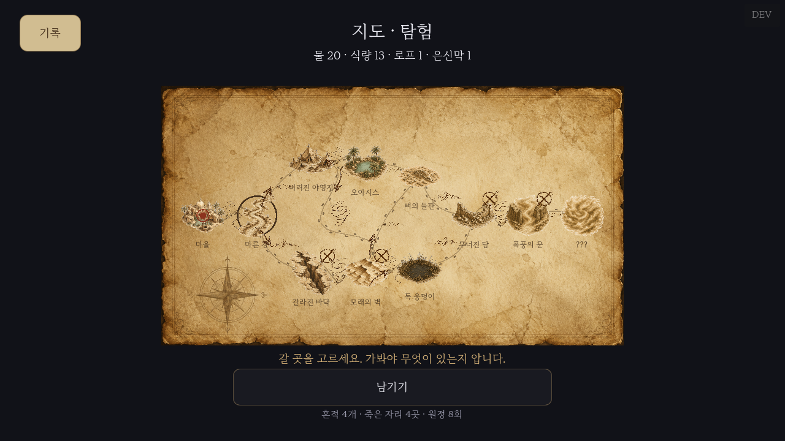

# 지도 핸드오프 (종합) — "See you on the other side"

> **용도:** 이 문서 하나로 게임의 **지도 관련 전부** — 작동 방식·시스템·데이터·UI·시각 디자인 — 를 외부(Claude 등)에서 이해하고 재설계·구현·디자인하기 위한 self-contained 브리프. 코드 접근 없이도 완결된다.
> **구성:** PART A(시스템·작동·데이터) → PART B(화면·레이아웃·시각). 시각만 필요하면 PART B부터 봐도 된다.
> **현재 모습:** 아래 스크린샷(데스크톱 1280×720, 실제 렌더본). 전반 UI 규칙은 같은 폴더 `UI_스타일_핸드오프.md` 참조.



---

## 0. 게임이 뭔가 (한 문단)

비동기 로그라이트. 매년 재앙을 멈추러 **원정대가 사막으로 떠나고 거의 다 죽는다.** 플레이어는 그 원정대를 거듭 보내는 총괄자이자 매 원정의 대장. 모래폭풍이 글씨를 지우는 세계라 말은 안 남고 **물건만 남는다** — 죽기 전 단 한 번, 다음 원정대에게 물건 하나를 남긴다. 정서 = 담담·서늘·쓸쓸함 + 릴레이의 옅은 희망. 톤 = 반지의 제왕 고지도 + 빛바랜 탐험 일지.

---

# PART A — 시스템 · 작동 방식 · 데이터

## A1. 코어 루프에서 지도의 위치

게임은 **두 화면을 오간다: 계획(지도) ↔ 실행(도착 단면).**

```
지도(계획): 갈 노드 선택
  → 맵 위에서 마커가 그 노드로 이동(거리만큼 자원 소모 + 이동 중 자잘한 상황 카드)
  → 도착 노드 "단면 탐색"(별도 화면): 제한된 조사 횟수로 지점들을 살핌 → 이벤트/자원/흔적/로프/빈손
  → 자원 고갈·위협으로 죽음(시체·죽은 자리) 또는 살아서 "남기기" 1회(물건 두고 계속)
  → 지도로 복귀(안개 걷힘·노드 흔적 마커) → 다음 노드 …
  → 목적지(end) 도달 → 순환/재회 엔딩
```

- **지도 = 계획 레이어.** 누적된 길 / 죽은 자리 / 남긴 흔적의 점을 보며 **어디로 갈지 고민**한다.
- **이동은 지도 위에서 일어난다.** (옛 모델의 "횡스크롤로 막대가 걷는다"는 **폐기됨** — 지금은 지도 노드 그래프에서 마커가 이동.)
- 핵심 동사는 액션이 아니라 **관리·판독·대비·남기기**. 턴제 사색형. 페이싱이 느긋해야 한다.

## A2. 노드 그래프 (지도의 뼈대 — 고정 데이터)

지도는 **고정된 노드 그래프**다(랜덤 생성 아님). 코드상 `scripts/core/MapGraph.gd`의 `NODES` 사전이 유일한 콘텐츠 집. 총 **11노드**, `row`(진행 단계 0~7) × `col`(분기축 0~1):

| row | 노드 | kind | biome | 분기 |
|---|---|---|---|---|
| 0 | 마을 | start | flats | (시작) |
| 1 | 마른 강 | cache | river | |
| 2 | 버려진 야영지 / 갈라진 바닥 | cache / blockage | flats / rock | 좌(0.28) / 우(0.72) |
| 3 | 오아시스 / 모래의 벽 | cache / storm | river / storm | 좌(0.3) / 우(0.72) |
| 4 | 뼈의 들판 / 독 웅덩이 | cache | flats / river | 좌 / 우 |
| 5 | 무너진 담 | blockage | rock | |
| 6 | 폭풍의 문 | storm | storm | |
| 7 | ??? (목적지) | end | | 재앙의 자리(맥거핀) |

- 각 노드 필드: `{kind, name, row, col, next[], biome, events[], spots[]}`.
- `kind`: **start**(마을) / **cache**(보급·수색) / **blockage**(차단·로프 필요) / **storm**(폭풍) / **end**(목적지).
- `next[]`: 이 노드에서 갈 수 있는 다음 노드들(그래프 엣지). 갈림에서 선택.
- `events[]`: 도착 시 뜰 수 있는 이벤트 카드 풀(선택지·결과·조건).
- `spots[]`: 도착 단면의 보조 조사 지점(자원·빈손 등).
- **이 구조·연결·개수는 게임 데이터라 고정이다.** 디자인/구현이 바꾸는 대상이 아니라, "이걸 어떻게 그리고 다루나"가 대상.

## A3. 핵심 시스템 (한 줄씩)

- **자원 = 수명.** 물·식량·로프·은신막(+주머니 도구: 약초·부싯돌·정화천). **걸음마다 거리에 비례해 닳고, 바닥나면 죽는다.** 무겁게 챙기면 걸음당 물 소모↑.
- **강한 미지.** 가본 노드만 정체 공개(장소 그림+이름), 갈 수 있는 다음은 **"?"**, 그 너머는 **안 보인다**. 안개가 원정마다 걷힌다(`visited_nodes` 영속).
- **이동 메커닉.** 노드 클릭 → 마커가 곡선 경로를 따라 보간 이동하며 한 걸음씩 자원 소모(상단 HUD 갱신) → 도착 or 이동 중 고갈사. **이동 중 자잘한 상황 카드**(엣지 중간마다 `Situations`에서 뽑아 모달로 결정받고 이동을 잇는다).
- **남기기(런당 1회) ↔ 줍기.** 살아서 물건 하나(물통/식량/로프/은신막)를 **밟은 노드(node_id)** 에 두고 *자원만 잃고 계속 전진*(죽음과 분리). 다음 원정대가 그걸 줍는다(유한 `uses`). "말은 안 남고 물건만 남는다"의 게임적 구현.
- **차단 로프 = 영구 지형.** 차단(blockage) 노드에 로프를 걸면 다음 원정부터 무료 통과(`bridged_nodes` 영속, self-async).
- **죽음.** 전부 **비자발적**(고갈·위협). "여기서 끝" 같은 자발적 죽음 없음. 죽으면 그 자리에 **시체·죽은 자리 흔적**(도착사=목표 노드 / 이동 중 사=떠나온 노드, `death_node_id`).
- **선택 반영 플래그(★ 최우선 설계 축).** 선택이 플래그를 남긴다 — `sets`(이번 런)/`sets_persist`(영속) → 이후 이벤트 `requires`가 그걸 보고 변형. 같은 런 연쇄 + 다음 원정 변형.
- **위협 삼각형.** 소모(갈증)·차단·폭풍. 각자 다른 대비 자원을 요구.
- **흔적 마커.** 지도에 노드별로 이전 원정대들이 남긴 것 표시 — 죽은 자리(X)·건 로프·남긴 자원점.

## A4. 아키텍처 (구현 시 반드시 — 데이터와 렌더 분리)

- **`scripts/core/` = 순수 데이터·로직**(RefCounted, 결정론, 노드트리·UI 미참조). 지도 관련 core:
  - `MapGraph.gd` — 노드 그래프 데이터(§A2).
  - `ExpeditionRun.gd` — 한 원정 상태·로직: 엣지 전진(`step`), 자원 소모·죽음, 도착 카드 계산(우선순위 = **차단 무료통과 > 줍기 > 이벤트**), 이동 중 상황, 남기기(`do_leave`). 흔적/차단/죽음은 **node_id 키**.
  - `Situations.gd` — 이동 중 상황 카탈로그·픽. `TraceData.gd` — 흔적(object_kind, node_id, tags, uses). `Threats.gd` — 위협 종류.
- **`scripts/ui/Map.gd` = 렌더·입력만.** core를 읽어 그린다. **core는 절대 ui를 참조하지 않는다.**
- **`GameState.gd`(autoload)** = 전역 상태·씬 라우팅·세이브(JSON). `traces/deaths/flags/visited_nodes/bridged_nodes/current_run`.
- → **지도 관련 데이터·규칙을 바꾸려면 core를, 보이는 방식을 바꾸려면 `Map.gd`를 만진다.** 둘을 섞지 말 것.

---

# PART B — 화면 · 레이아웃 · 시각

## B1. 현재 화면 구성 (스크린샷의 요소들)

위에서 아래로:
1. **상단** — 제목 "지도 · 탐험"(중앙) + 자원 HUD("물 20 · 식량 13 · 로프 1 · 은신막 1"). 좌상단 **"기록"** 버튼, 우상단 **"DEV"**(개발용, 정식 빌드 숨김 — 무시).
2. **가운데(핵심)** — 양피지 지도. 그을린 테두리의 낡은 종이. 위에:
   - **노드**: 손그림 장소 아이콘 + 이름. 마을→마른 강→…→??? 로 **왼쪽→오른쪽**(가지 분기).
   - **길**: 세피아 잉크 곡선. 밟은 길=실선+발자국, 미지=점선. 갈림엔 실제 간 방향 화살표.
   - **원정대 마커**(붉은 세피아 잉크 방울), **나침반**(좌하단), **지형지물**(강·산·사구·폭풍·해골 손스케치).
   - 미방문 노드 = 흐린 **"?"**.
3. **하단** — 안내문 + **"남기기" 버튼** + 통계("흔적 4개 · 죽은 자리 4곳 · 원정 8회").

## B2. 레이아웃 스펙 (반응형 — 가로/세로 둘 다)

- **논리 해상도 600×720, stretch `canvas_items`/`expand`.** → **데스크톱은 가로로 넓어지고(≈1280×720), 폰은 세로로 길어진다.** 한 레이아웃이 둘 다 대응.
- **지도 영역** = 제목·HUD 아래 ~ 하단 버튼 위 창에, **배경 이미지를 종횡비 유지로 온전히(contain)** 넣은 rect. **배경과 노드가 이 영역을 공유.**
- **배경 이미지는 세로 원본 720×1280.** 폰(세로)엔 그대로, **데스크톱(가로)엔 90° 회전본(1280×720)**(나침반이 방사대칭이라 회전 티 안 남).
- **데스크톱에선 지도가 화면 중앙에 가로 띠로 들어가고 좌우에 여백이 남는다**(스크린샷). 이 여백은 **의도적으로 비워둠** → B5 참고.
- **노드 배치:** 진행축(가로=데스크톱)에 마을(row0)~목적지(row7) 8단계, 분기축(세로)에 갈래(col). 아이콘은 노드 간격에 비례(안 겹치게), 진행축 끝 여백을 둬 첫/끝 노드가 밖으로 안 삐지게.

## B3. 비주얼 요소 & 에셋

- **배경:** `01_지도_양피지.png`(720×1280, 그을린 테두리+나침반+양피지 결). 실제 이미지.
- **노드 아이콘:** kind별 손그림 장소 그림 PNG(방문한 노드만).
- **지형지물 = 원정대 손스케치 "낙서" (반드시 있어야 함):** 강/산/사구/폭풍/해골/경고/화살표 손그림 PNG(세피아 펜). **방문한 구간에만 나타난다** — 원정대가 지도에 그려 넣은 약도·표식(세계관: 안개가 걷히며 드러남). **경로 바깥에 장애물처럼 배치**해서, 길이 그 지형을 피해 돌아가는 것처럼 보이게 한다. 지도를 "살아있는 탐험 일지"로 만드는 핵심 장치라 빠지면 안 된다. (해골=죽은 자리·경고=위험 노드·화살표=갈림에서 간 방향.)
- **길은 지형을 돌아 굽이친다 (직선 금지):** 노드를 잇는 길은 **biome(지형)에 맞춰 곡선으로 우회**한다 — 강=한 번 사행(S 굽이), 바위·산=크게 한쪽으로 우회, 폭풍·사구=흔들리는 지그재그, 평지=완만한 미세 굴곡. "실제 지형을 피해 돌아가는 옛 지도의 길" 느낌. 단 곡률이 과해 어수선하면 안 됨(정돈된 굽이).
- **길·마커·발자국·안개점·"?":** 곡선 포함 **전부 절차적 `draw_*`(코드로)** — 이미지 아님. 세피아 잉크 톤. 밟은 길=실선+좌우 발자국, 미지로 향하는 길=점선.
- **톤 이질:** 장소·아이템 아이콘은 사진풍, 지형지물 낙서는 펜 스케치라 톤 다름(통일 여지).

## B4. 팔레트 · 타이포 (지도 표면)

- **양피지 표면:** PAPER `#D1BD91` · PAPER_EDGE `#947A52` · INK(세피아) `#45301C` · INK_FADE(미지) `#80694A` · 트레일 `#452F1C` · 마커 `#8C331F`.
- **UI 크롬(어두운 표면, 지도 밖 여백·버튼):** 무대 `#08070A` · 가죽 패널 `#241A11` · 가죽 테두리 `#8C6B3D` · 아이보리 글자 `#F6ECD4` · 강조 SAND `#D6B278`. (전체 표 = `UI_스타일_핸드오프.md §3`.)
- **폰트:** 본문·제목 = 마루부리(명조), 영문 로고 = Cinzel, **지명·붓 느낌 = 나눔손글씨 붓**(지도 지명 전용). 전부 한글 글리프 필수(웹에서 두부 방지). 장식 유니코드 금지.

## B5. 디자인이 풀어줬으면 하는 것 (핵심 요청)

1. **★ 데스크톱 좌우 여백 활용.** 가로 화면에서 지도 양옆이 비어 있다. 게임 톤에 맞는 무언가를 채우고 싶다 — **범례**(아이콘 뜻)·**자원 상세**·**원정 기록/통계**·**설정**·**인벤토리**(바로 아래)·또는 지도를 감싸는 **가죽/양피지 장식 프레임**. 배치안 제안 환영.
   - **인벤토리창 (계획됨, 다른 세션과 논의 — `backlog.md §8(c)`):** "가방" 버튼으로 여는 **지금 지닌 것** 화면 — 보유 아이템(물통·식량·로프·은신막 + 주머니 도구) 표시 + **호버 시 아이템 상세 설명**. **원정 중에도 열람 가능**(autoload 오버레이, 기존 "기록"(`Bookmark`) 버튼과 같은 패턴). **데스크톱에선 이걸 지도 옆 여백에 상시 패널로** 두는 것이 유력(여백 활용의 1순위 후보), 폰에선 버튼→오버레이. 가방 챙기기 화면(`Loadout`)도 창고/테이블에서 아이템 집는 방식으로 개편 예정(`art_prompts.md §13`, 배경 `39_배경_창고`).
2. **전체 구성·위계** — 제목·HUD·지도·버튼 배치가 "낡은 탐험 일지"처럼 정갈한지. 지도가 주인공인지.
3. **노드/길 시각 스타일** — 노드 칩·이름 라벨·길 곡선·마커가 양피지 위에서 읽기 좋고 아름다운지(가독성 + 분위기).
4. **여백/프레임 미감** — 지도 띠와 검은 무대의 경계, 그을린 가장자리.

**폰(세로)도 고려** — 세로에선 여백이 거의 없고 지도가 위→아래로 길다. 데스크톱 여백 UI가 세로에서 어디로 갈지(접기/하단)도.

## B6. 제약 (반드시)

- **Godot 4.6, 2D, GDScript, 웹 export + GL Compatibility + 모바일 터치 우선.**
- **셰이더·GPUParticles 금지**(웹 깨짐). 효과는 CPU/절차적/CPUParticles2D만.
- **에셋 경량**(웹 빌드 이미 무거움). 새 텍스처는 작게·적게(9-patch·타일).
- **한글 필수. 터치 타깃 큼직**(버튼 60~76px). **투명 PNG는 흰 배경으로 뽑고 코드로 흰→투명 변환**(생성기 체커보드 금지).

## B7. 산출물 & 통합 (뽑아온 걸 어떻게 붙이나)

지도는 `scripts/ui/Map.gd`의 **절차적 `draw_*` + 이미지 에셋**으로 그린다. 받고 싶은 것:
- **레이아웃 목업/스펙**(데스크톱·폰, 여백에 뭘·어디에, 치수·비율) → 코드로 옮김.
- **여백 프레임/장식 PNG**(선택, 9-patch: 흰배경→투명 + 모서리 여백 px 명시).
- **노드 칩·라벨·길·마커 스타일 가이드**(절차적 draw로 재현할 선 두께·색·형태).
- **범례/사이드 패널 디자인**(여백 활용안).
- **시스템을 바꾸고 싶으면**(예: 노드 추가·이동 규칙): PART A의 데이터 구조(`MapGraph.NODES` 필드)·규칙에 맞춘 제안으로. 구현은 core에서.

**형식:** "게임에 바로 꽂을 PNG 타일 + HEX + 치수"가 SVG/피그마보다 통합이 빠르다.

## B8. 코드 지도 (어디를 만지나)

| 무엇 | 파일 |
|---|---|
| 노드 그래프 데이터(콘텐츠) | `scripts/core/MapGraph.gd` |
| 이동·자원·죽음·흔적·남기기 로직 | `scripts/core/ExpeditionRun.gd` |
| 이동 중 상황 | `scripts/core/Situations.gd` |
| 흔적/위협 데이터 | `scripts/core/TraceData.gd`, `Threats.gd` |
| **지도 렌더·입력(시각 작업의 주 대상)** | `scripts/ui/Map.gd` |
| 색·치수·폰트 | `scripts/ui/UITheme.gd` |
| 전역 상태·세이브 | `scripts/GameState.gd` |

## B9. 요약 한 줄

**"낡은 양피지 위의 원정 계획도"** — 고정 노드 그래프를 세피아 잉크로 그리고, 자원=수명으로 한 걸음씩 나아가며, 죽고 남긴 흔적이 다음 원정의 지도를 바꾼다. **구조·규칙(PART A)은 고정, 시각 표현·레이아웃·여백 활용(PART B)은 자유.** 당면 과제는 데스크톱 가로 여백을 게임 톤으로 채워 한 장의 완결된 탐험 일지를 만드는 것.
